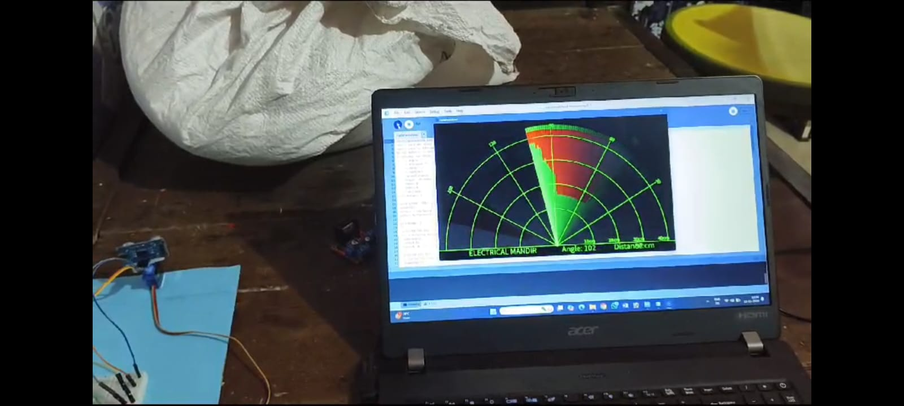

# radar_system
 Radar System using Arduino Uno R3
# Radar System using Arduino Uno R3

A simple and functional radar system using **Arduino Uno R3**, an ultrasonic sensor, and a servo motor. This project visualizes detected objects on a 2D plane by scanning the environment and displaying the output using processing software.

## Features
- Detects objects within a specified range using an ultrasonic sensor.
- Rotates the sensor on a servo motor to scan a 180-degree field.
- Displays the scanned data on a 2D radar-like interface using Processing software.

---

## Components Required

### Hardware
- Arduino Uno R3
- Ultrasonic Sensor (e.g., HC-SR04)
- Servo Motor (e.g., SG90)
- Jumper Wires
- Breadboard
- USB Cable
- Power Supply (optional)

### Software
- Arduino IDE
- Processing IDE (for radar visualization)

---

## Circuit Diagram

### Connections
1. **Ultrasonic Sensor (HC-SR04)**:
   - VCC: Connect to 5V pin on Arduino
   - GND: Connect to GND pin on Arduino
   - Trig: Connect to Digital Pin 9
   - Echo: Connect to Digital Pin 8

2. **Servo Motor (SG90)**:
   - VCC: Connect to 5V pin on Arduino
   - GND: Connect to GND pin on Arduino
   - Signal: Connect to Digital Pin 10

---

## Installation and Setup

### 1. Code for Arduino
1. Clone this repository:
   ```bash
   git clone [clone](https://github.com/CodeGoura/radar_system.git)
   ```
2. Open `radar2.ino` in Arduino IDE.
3. Upload the code to your Arduino Uno R3.

### 2. Processing Sketch
1. Open `radarprocessing.pde` in the Processing IDE.
2. Run the sketch to visualize the radar data.

---

## Usage
1. Assemble the circuit as per the diagram.
2. Power on the Arduino Uno R3.
3. Run the Arduino and Processing codes.
4. Observe the radar display on the Processing interface. Objects within range will appear as blips on the screen.

---

## Code Overview

### Arduino Code (`radar_system.ino`)
- Sends a trigger pulse to the ultrasonic sensor.
- Reads the echo pulse to calculate distance.
- Controls the servo motor to rotate step by step for scanning.
- Sends distance data to the Processing sketch via serial communication.

### Processing Code (`radar_visualization.pde`)
- Reads data from the serial port.
- Maps distance data to radar visualization coordinates.
- Displays real-time radar-like animation.

---

## Customization
- Adjust the field of view (default is 180 degrees) by modifying the servo angle range.
- Tune the ultrasonic sensor's range for optimal performance.

---

## Example Output

*Image showing the radar interface with detected objects.*

---

## Troubleshooting
- Ensure proper wiring and secure connections.
- Check the serial port configuration in both Arduino and Processing sketches.
- Use an external power source for the servo motor if it behaves erratically.

---

## License
This project is licensed under the MIT License. See the `LICENSE` file for details.

---

Happy building! 🚀
